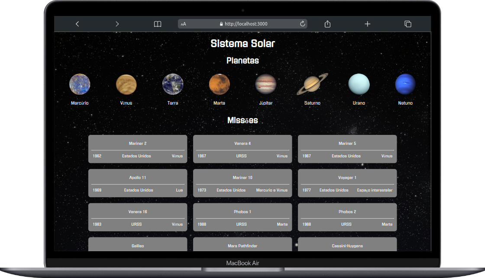
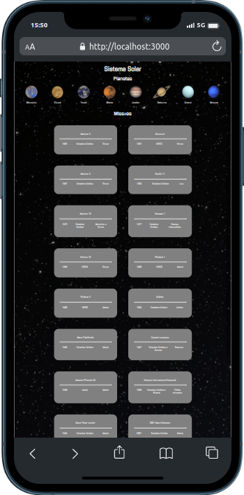

# Project Solar System
O projeto Solar System é uma aplicação React que permite demonstrar as missões espacias aos planetas do sistema solar. Esta aplicação apresenta uma interface amigável, permitindo aos usuários explorar detalhes de missões espaciais aos planetas do sistema solar. Os usuários poderão facilmente visualizar informações importantes, como o nome da missão, o ano em que foi realizada, o país responsável pelo seu desenvolvimento e o ano em que ocorreu.
Este projeto foi desenvolvido no curso de desenvolvomento web da Trybe no módulo de Front-End e conta com o uso de React.
# Demonstração

<div style="display:flex" >
  

  
</div>
- [Veja o projeto em ação](https://project-solar-system-iota.vercel.app/) 🎬

> Para o deploy do projeto fora utilizado o [Vercel](https://vercel.com/)

## 💡 Habilidades desenvolvidas:

- Uso de conceitos de React como componentes, props e composição de componentes.

## Instalação
Certifique-se de ter o Node.js instalado em sua máquina.

1.  Clone este repositório em sua máquina local:
```
git clone git@github.com:ricardokuhlkamp/project-solar-system.git
```
2.  Acesse o diretório do projeto:
```
cd project-solar-system
```
3.  Instale as dependências do projeto usando npm (Node Package Manager):
```
npm install
```
Isso iniciará o aplicativo React em modo de desenvolvimento e abrirá automaticamente no seu navegador padrão. A aplicação localmente utilizará localmente a porta 3000 (http://localhost:3000).

---

### __Contato__
Se tiver alguma dúvida ou sugestão, sinta-se à vontade para entrar em contato comigo:

E-mail: <ric.kds@hotmail.com>

GitHub: [github.com/ricardokuhlkamp](https://github.com/ricardokuhlkamp)

Linkedin: [www.linkedin.com/in/ricardo-kühlkamp-dev](www.linkedin.com/in/ricardo-kühlkamp-dev)

---

